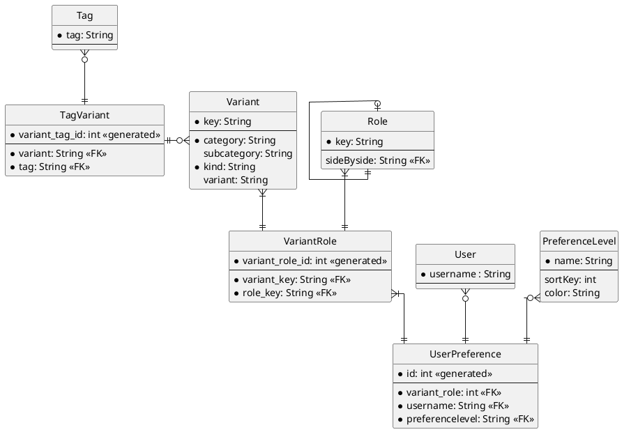

# kinks

## Project setup
```
npm install
```

### Compiles and hot-reloads for development
```
npm run serve
```

### Compiles and minifies for production
```
npm run build
```

### Lints and fixes files
```
npm run lint
```

### Customize configuration
See [Configuration Reference](https://cli.vuejs.org/config/).

### Datastructure



as seen on [plantuml](//www.plantuml.com/plantuml/png/ZLDDZvmm3BtdLrXxgRGIVw1QhLOzzB8zLFteTPG5BqGJ4kIO6Q61_zuaD0GeAyq5sSzstlCBUN4iYVjMYq_Gg0g16mJNMHOnAnML6eKloejL5NHatpIs3gwA6v2crbX1IVRgu1sHXJihqqcIBMXba8SEmH8tLWWqh7Y0XzyEwG6aWzu7S1C0Zo4oiaNu33-PbAazM1HY4ddgZoGb3SV1onpFisSSDbC1AoLZRMbTSFtR0VherLOvJoSlo9G5_99r96TPpyG-s13lchFWEBFH_2yvUVoaFB_oXQUd6WsIPAoUdvTDTe9yrzVNKCxq6LqB-4xuZeIcn6zuGHrLT0kc0pPB2RRl_NEM-1M7gCkdfTMM5Yu8DC64oHR5EAvs4pc4SIpiBTcPPVsm6gCMyi67z-TKXL-6y3tOC4wECtU8__j54aTYJrJPze3Sv_ifgrjx7mv8fPsyPC0q1eLh3L7v4Rvv6VdYbZUIxsrUupxbuUZKbtIdTtQmqkxdEDXirv7kVwjGXFIubAn9DXnqlA2f-bR_1G00)
